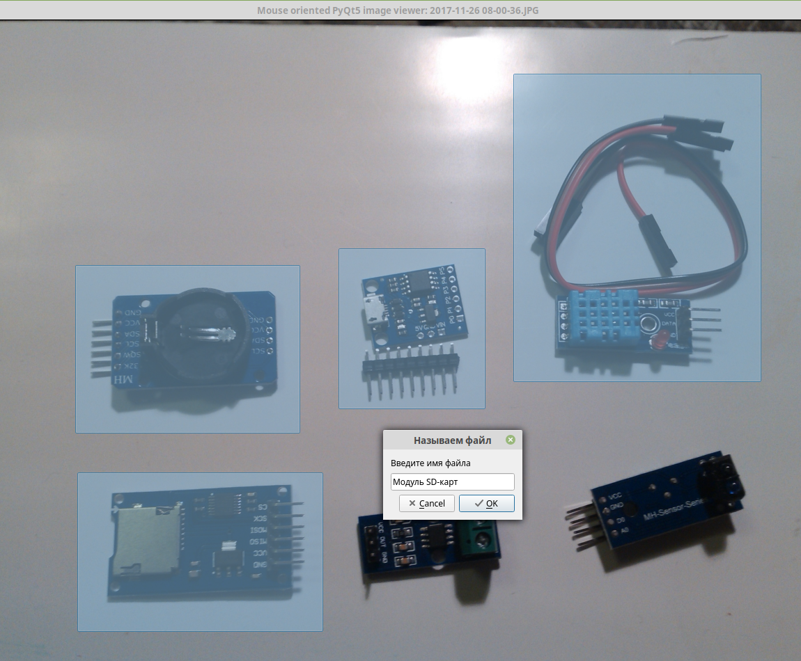
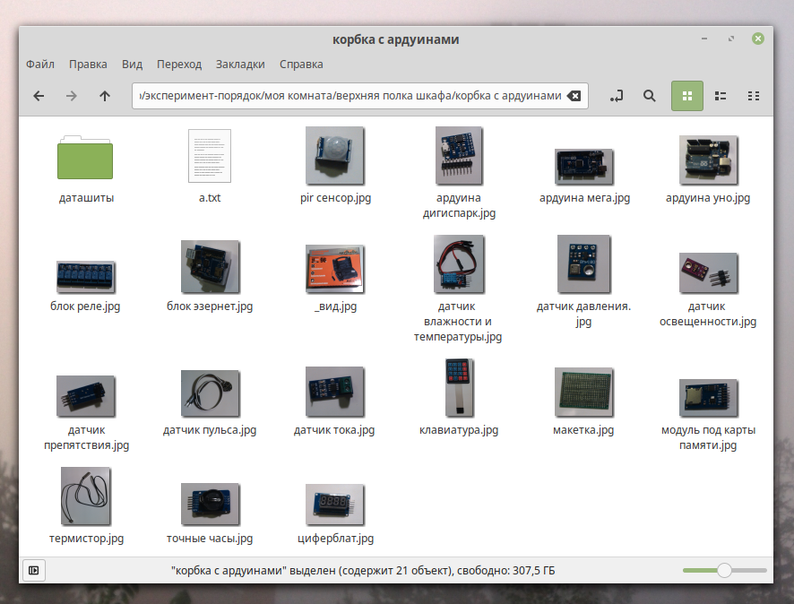

# Разгребатор
Десктопное приложение для быстрой нарезки изображений - можно выделить объекты на фотографии и потом просто вводить их названия, фрагменты будут сохранены в указанной папке. Выглядит это вот так:



В результате получается папка с фрагментами фотографии, которым даны нормальные названия:



Изначально программа создавалась для учета большого количества редкоиспользуемого хлама, который невозможно запомнить. По названию папок можно понять, где вещь лежит, а за счет нормальных названий можно использовать поиск по файлам.

## Технические детали
Проект сделан на **Python 3** с использованием библиотек **PyQt5** и **Pillow** на основе [просмотрщика](https://github.com/inaugurator/mopyqtiv) изображений. Для windows-пользователей с помощью pyinstaller собран .exe-файл в папке ```dist/```. Антивирусы обычно не очень любят сборщики скриптовых языков, проверял exe на virustotal - Avast и Yandex ругаются, NOD32, DrWeb и другие пропускают.

## Описание интерфейса
При запуске появляется диалог выбора файла, в котором надо открыть нужную фотографию. Далее появляется сам просмотрщик изображений, стрелками можно листать фотографии, колесиком мыши менять масштаб, при нажатом колесике тащить увеличенное изображение, с помощью esc выходить. К просмотрщику добавлены функции нарезки - при зажатой ЛКМ можно выделять фрагменты, а при нажатии ПКМ появляется меню. В этом меню наиболее интересные пункты: "Отменить" - снять последнее выделение, "Папка для сохранения" - изменить папку, куда будем сохранять нарезку, и "Распотрошить" - запускает процедуру ввода названий для выделенных объектов. Название вводится для последнего выделения, потом для предыдущего и т.д.
